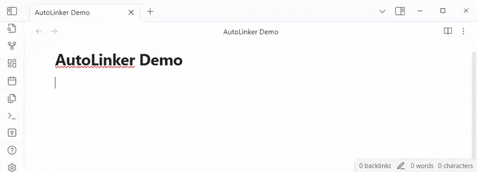
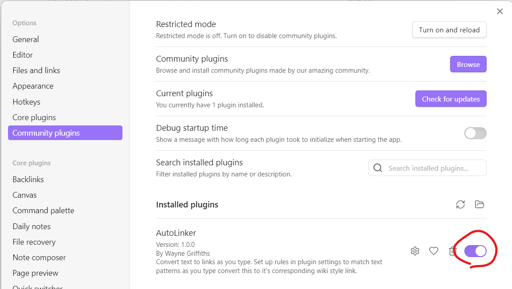
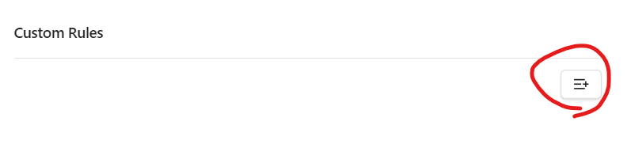
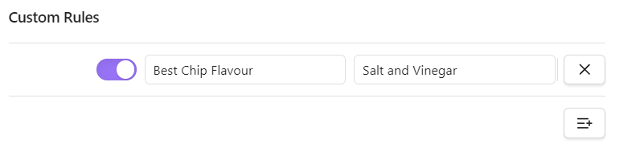
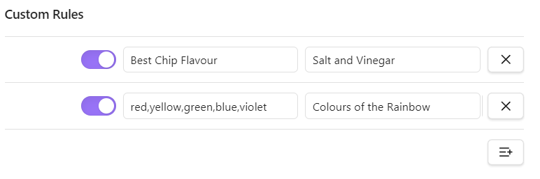
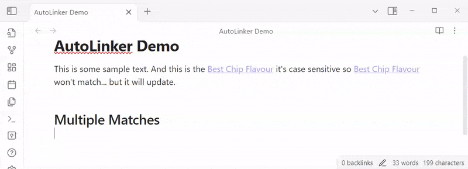

# AutoLinker
A very simple plugin that allows you to define text to match and convert that text to a link as you type. This aims to help craft meaningful backlinks without needing to remember to backlink.



## Installation
### Obsidian Plugin store
Not Available Yet 

### Via Install Script
1. Clone down this repository to your local machine.
    ```sh
    git clone git@github.com:wannabewayno/AutoLinker.git && cd AutoLinker
    ```

2. Run the provided installer script.\
The first and only argument to the installer script will be the absolute directory of the vault you wish to add the plugin to.

    **Powershell:**
    ```sh
    ./install.ps1 /path/to/your/vault
    ```
    *__Note:__ If you encounter a permission denied error, ensure the script is executable with `chmod +x ./install.sh`* 

    **Bash:**
    ```sh
    ./install.sh /path/to/your/vault
    ```

3. Restart Obsidian to reload plugins.
4. Enable the plugin in your vault settings.


### Manually
1. Clone down the repository.
    ```sh
    git clone git@github.com:wannabewayno/AutoLinker.git && cd AutoLinker
    ```

2. Build the Plugin.\
    **Node**
    ```sh
    npm run build
    ```

    **Bun**
    ```sh
    bun run build
    ```

3. Export your vault path for later reference
    1. First extract the pluginId from the manifest.
        ```sh
        export PluginId="$(jq -r '.id' ./manifest.json)"
        ```
    2. export the plugin dir
        ```sh
        export PluginDir="$VaultDir/.obsidian/plugins/$PluginId"
        ```

4. Create the plugin directory in your target vault
    ```sh
    mkdir -p $PluginDir
    ```

5. Move the necessary plugin files to your vault's plugin folder.
    ```sh
    cp ./{main.js,styles.css,manifest.json} $PluginDir
    ```

6. Restart Obsidian
7. Enable the plugin in your vault settings


## Usage
AutoLinker is dead simple to use, it backlinks shortcuts as you type

### Create your first rule.
1. Go to the plugin's settings

2. Create an entry for a new Rule


3. Add your rule



### Multiple matches
You can have multiple matching rules by using a comma-separated list.



## Known Issues
### Multiple Instances of Active Note
I am currently aware of an issue where if two instances of active note is open (one in the side bar and one as a tab), then this plugin doesn't work as the 'active' workspace doesn't know what to target. It's a low prio bug as it's very rare you would need to have two open at any one point in time

### Callouts
Unfortunately this is active inside callouts which can cause issues with `[Note] Title` syntax

### Code Blocks
Unfortunately this is also triggers inside code blocks, which is undesirable, no fix is planned a the moment, but we are aware of the issue.

### Commas
Inserting a comma after a rule won't trigger the matcher to recognise this.
This is a known bug.

## Road Map
This is a simple plugin, but we're thinking of expanding it's capabilities to make it more context aware so it can be ultra personable to you.
If you see something not listed, please [contact us](#contact) and it might be something we also might like to use

### Features
- [ ] Manifest of links and their frequency, show suggestions in settings for you to turn on.
#### Natural Language Processing
- [ ] Plurals
- [ ] Names
- [ ] Locations
- [ ] Other Links

### Performance
- [ ] Sort matching rules from most frequent to least frequent.
- [ ] Debounce the execution until the user stops typing.
- [ ] Only execute matching if a whole phrase/word is found (i.e not per character)

## Contact
Wayne Griffiths


## Developing
For an integrated development environment when developing an Obsidian plugin, you can open a test vault with this plugin in it and install the hotrealod plugin provided by Obsidian that reloads plugins when they change, couple that with typescript watcher that rebuilds the bundle whenever code changes and you will have live reloading.

Exact steps for this need to be added...